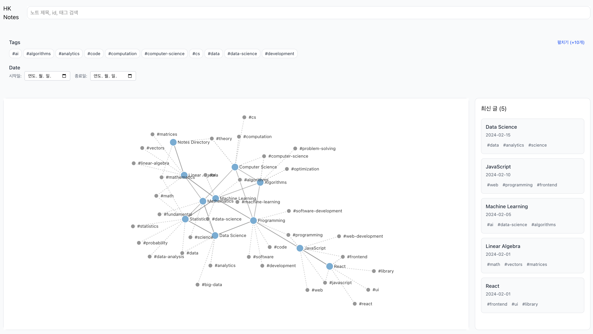
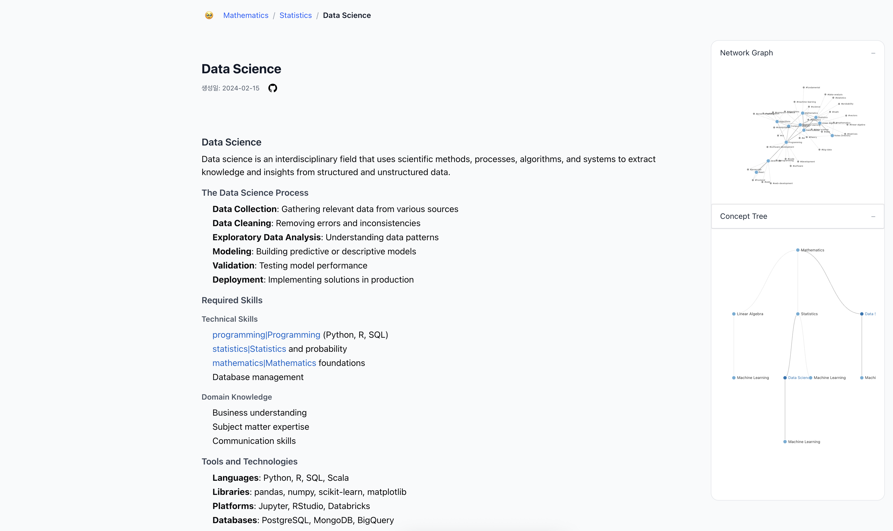

개인 노트 모음집에 가까운 블로그 입니다.

 

메인

 

상세 페이지

 

---

평소 공부할 때 연관 개념과 상·하위 개념을 정리해두는 것을 좋아합니다. 개념 사이의 위치를 확인하고 방향을 잃지 않고자 입니다.

이를 위해 각 노트마다 연관 개념과 상·하위 개념을 기록하고 백링크 혹은 언급으로 연결하여 위키 시스템처럼 탐색할 수 있도록 구성합니다.

옵시디언은 이러한 네트워크형 연결을 시각적으로 보여주는 훌륭한 도구지만, 네트워크 그래프는 연관 관계 파악에는 유용하나 상·하위 관계 확인에는 한계가 있었습니다. 마인드맵 형태로 정리할 수도 있으나 수작업이 필요하다는 단점이 있습니다.

그렇게 수많은 노트앱을 떠돌다 지쳐 한 번 만들어 보았습니다.

 

**요구사항**

1.	연관된 노트를 네트워크 그래프로 시각화할 수 있어야 한다.
2.	상위 노트를 지정하여 가계도 형태로 상·하위 개념을 시각화할 수 있어야 한다.
3.	마크다운 문법을 지원해야 한다.
4.	[[ ]] 문법을 언급으로 인식해야 한다.
5.	태그 기능을 지원해야 한다.

 

**기술 스택**

- React 19
- Typescript 
- TailwindCss 4.0.6
- Tanstack Router 1.13
- marked (마크다운 파서)